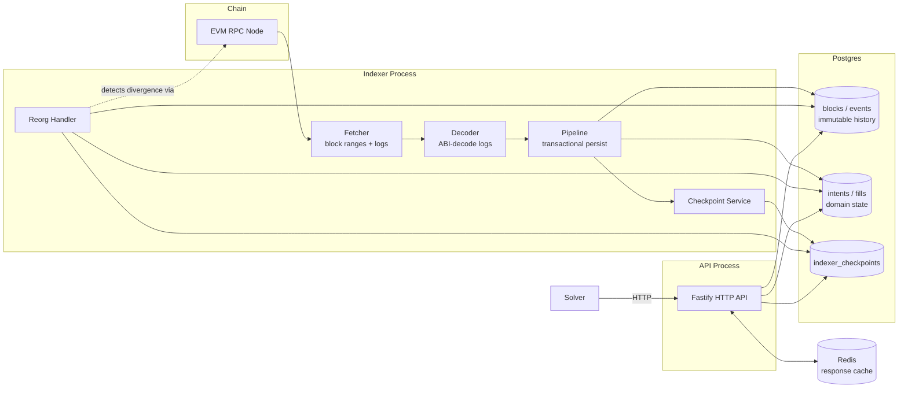

# Solver Indexer

A solver-oriented EVM indexer for an intent protocol: it watches one contract's `IntentCreated` /
`IntentCancelled` / `IntentFilled` events, projects them into queryable intent/fill state, and
serves that state over a cache-backed HTTP API a solver can poll.

## Problem

A solver needs to answer questions like "which intents are open right now" or "has intent X been
filled" many times a second, filtered and paginated, without ever missing a fill or double-acting
on a cancelled intent. Direct RPC access can't do this:

- **No queries, only logs.** `eth_getLogs` returns raw, undecoded events for a block range — there
  is no "list open intents" or "has this intent been filled" call. Every solver would have to
  replay the entire event history itself, on every process, just to answer one question.
- **No historical state.** An RPC node gives you the state *now*. Reconstructing "what were the
  open intents as of block N" (or across a chain reorg) means re-deriving it from logs yourself,
  every time.
- **No aggregation.** Counting open intents, listing fills for an intent, or paginating a filtered
  intent list all require indexed, queryable storage — an RPC endpoint has no index to query.
- **Reorgs.** Logs from a re-orged block are simply gone from the next `eth_getLogs` response,
  with no signal that state derived from them (e.g. "intent X is FILLED") is now wrong. Something
  has to detect that and roll the derived state back.
- **Rate limits and latency.** Every solver re-deriving state from raw logs multiplies RPC load
  and adds the RPC's own latency to every decision a solver makes.

This project solves all of the above once, centrally: index the chain into Postgres, derive
correct domain state (with reorg handling), and let every solver read a fast, filtered,
paginated HTTP API instead of talking to the chain directly.

## Architecture



Two independent, stateless-except-for-Postgres processes:

- **`apps/indexer`** — a single long-running poll loop. Owns all writes. One process per chain.
- **`apps/api`** — a Fastify HTTP server. Read-only; never writes to Postgres. Stateless (can run
  multiple replicas behind a load balancer, since all shared state lives in Postgres/Redis).

They never talk to each other directly — Postgres (source of truth) and Redis (cache, optional)
are the only shared state between them.

## Data Flow

```
RPC → ingestion → decoding → persistence → domain projection → API → cache → solver
```

1. **RPC** (`apps/indexer/src/rpc`) — a thin wrapper over viem's `PublicClient`, retried with
   exponential backoff, validated against the configured `CHAIN_ID` at startup, and scoped to one
   `CONTRACT_ADDRESS` so `eth_getLogs` only ever returns that contract's logs.
2. **Ingestion** (`apps/indexer/src/fetcher`) — splits `[startBlock, safeBlock]` into fixed-size
   chunks, fetches each chunk's logs plus the block metadata those logs reference.
3. **Decoding** (`apps/indexer/src/decoder`) — ABI-decodes each log against the intent protocol
   ABI (`packages/abi`). Logs that don't match a known event are dropped, not errored — a chain
   can emit plenty of logs the indexer doesn't care about.
4. **Persistence** (`apps/indexer/src/pipeline`) — every block and decoded event in one chunk is
   written to Postgres in a **single transaction**, alongside its domain projection and the
   checkpoint advance. See [Indexing Strategy](#indexing-strategy).
5. **Domain projection** (`apps/indexer/src/projection`) — turns raw decoded events into
   `intents`/`fills` rows with a validated state machine (`OPEN → CANCELLED | FILLED`).
6. **API** (`apps/api`) — Fastify routes read `intents`/`fills`/`indexer_checkpoints` directly.
   Every response reports the checkpointed block it reflects.
7. **Cache** (`apps/api/src/lib/cache.ts`, `packages/database/src/cache.ts`) — a short-TTL
   Redis read-through in front of the hottest routes. Optional; every route works without it.
8. **Solver** — polls `GET /api/v1/solver/state` and `GET /api/v1/intents?status=OPEN` instead of
   talking to the chain.

## Database Model

| Table                 | Purpose                                                                                                                                                                                                                        |
| ---------------------- | -------------------------------------------------------------------------------------------------------------------------------------------------------------------------------------------------------------------------- |
| `chains`               | One row per indexed chain (`chain_id`, display `name`). `latest_block`/`indexed_block` mirror the live checkpoint for quick multi-chain listing; `indexer_checkpoints` is the value the indexer actually resumes from. |
| `blocks`                | Every block the indexer has touched, keyed `(chain_id, block_number, block_hash)`. `is_canonical` flips to `false` when a reorg orphans it — rows are never deleted for blocks, only relabeled. A partial unique index enforces at most one canonical block per height. |
| `events`               | Immutable append-only log of every decoded event, keyed `(chain_id, transaction_hash, log_index)`. Never mutated except `is_canonical`, which a reorg flips the same way as `blocks`. This is the audit trail domain state is derived from. |
| `intents`               | Current derived state per intent (`OPEN`/`CANCELLED`/`FILLED`), one row per `(chain_id, intent_id)`. Amounts are `numeric(78,0)` to hold a full uint256 without precision loss. Rewritten in place as new events arrive — this is a materialized view of `events`, not independent history. |
| `fills`                 | One row per `IntentFilled` event, keyed `(chain_id, transaction_hash, log_index)`. A `fills.intent_id` foreign key ties it to its intent. |
| `indexer_checkpoints`   | One row per `(chain_id, indexer_name)`: the last block number + hash successfully committed. The single source of truth for where indexing resumes and how far reorg detection compares against. |

`blocks`/`events` are the immutable raw layer; `intents`/`fills` are the queryable domain layer
derived from it. A reorg rewinds both layers together, in one transaction — see
[Reorg Strategy](#reorg-strategy).

## Indexing Strategy

- **Chunking** (`apps/indexer/src/fetcher/ranges.ts`) — `[startBlock, safeBlock]` is split into
  fixed-size (`INDEXER_CHUNK_SIZE`) ranges, fetched and persisted one at a time, in order. This
  bounds both the `eth_getLogs` window (RPC providers cap range size) and the size of each
  transaction.
- **Checkpointing** (`apps/indexer/src/checkpoint`) — `indexer_checkpoints` records the last
  block number *and hash* successfully committed. The checkpoint only ever advances inside the
  same transaction as that range's block/event/domain writes (`pipeline/persist.ts`) — a range
  that fails partway rolls everything in it back, checkpoint included, so the checkpoint never
  points past data that isn't actually there.
- **Retries** — two layers: the RPC client retries individual failed calls with exponential
  backoff (`rpc/retry.ts`), and the fetcher retries a whole range as a unit on top of that
  (`fetcher/fetcher.ts`). A range that still fails after retries throws and stops the poll cycle;
  the next poll interval retries from the last committed checkpoint — nothing is skipped.
- **Idempotency** — every insert (`blocks`, `events`, `intents`, `fills`) uses
  `onConflictDoNothing`/status-aware upserts, and every domain transition checks current state
  before applying. Re-processing an already-indexed range (a restart with no new checkpoint, a
  retried range, a replayed reorg range) is always a safe no-op, never a duplicate row or a
  corrupted transition. See `apps/indexer/src/projection/README.md` for the full state-transition
  table.

## Reorg Strategy

Every poll cycle, before indexing anything new, the indexer re-fetches the block at its last
checkpointed height and compares its hash to what's stored locally. A mismatch means the chain
reorganized underneath the last checkpoint.

1. **Find the common ancestor** (`apps/indexer/src/reorg/reorg.ts`) — walk backward from the
   divergent height, comparing the chain's current view of each block against what's stored
   locally as canonical, until they agree (or a height has no local record — nothing to
   disagree with). Bounded by `MAX_REORG_DEPTH` (20 blocks); a deeper reorg raises
   `ReorgTooDeepError` and halts indexing rather than silently doing the wrong thing.
2. **Rollback, in one transaction** — every `blocks`/`events` row at or above the ancestor is
   marked `is_canonical = false` (never deleted — they stay as audit trail), the domain
   projections derived from those events are undone (`projection/rollback.ts`: fills from the
   reorged range deleted, intents created there deleted, intents merely updated there reopened
   to `OPEN`), and the checkpoint is restored to the ancestor.
3. **Replay** — re-fetching and re-indexing the new canonical chain from the restored checkpoint
   is just the next normal indexing pass (`runIndexingPipeline`). No separate replay machinery.

## Finality

`CONFIRMATIONS` (default 5) defines the **safe block**: `chainHead - CONFIRMATIONS`. The indexer
never processes past it — `safeBlock = latestBlock - CONFIRMATIONS`, and every chunked range is
capped there. This is a probabilistic-finality guard on top of the reorg handling above: it
keeps ordinary small reorgs from ever being observed as indexed data in the first place, so the
(bounded, but non-zero-cost) rollback path in [Reorg Strategy](#reorg-strategy) is only needed for
reorgs deeper than `CONFIRMATIONS`.

## Query Layer

All routes are prefixed `/api/v1` and return a consistent envelope:

```json
{ "success": true, "data": ..., "indexedBlock": 21000000 }
```

`indexedBlock` is read from `indexer_checkpoints` **before** the query it accompanies runs, so it
never claims freshness the returned rows don't actually have (see
`apps/api/src/lib/indexed-block.ts`). Errors use `{ "success": false, "error": { "message", "code" } }`.

| Method & Path                          | Description                                                                 |
| --------------------------------------- | ---------------------------------------------------------------------------------- |
| `GET /api/v1/health`                    | Liveness — process is up. No dependency checks.                                    |
| `GET /api/v1/ready`                     | Readiness — Postgres reachable, Redis reachable (if configured), app bootstrapped. `503` if not. |
| `GET /api/v1/indexer/status`            | Checkpointed block/hash/updatedAt for the configured chain.                        |
| `GET /api/v1/intents`                   | Paginated, filterable intent list. Query: `status`, `owner`, `tokenIn`, `tokenOut`, `limit` (≤100, default 20), `cursor`. |
| `GET /api/v1/intents/:intentId`         | Single intent by id. `404` if unknown.                                             |
| `GET /api/v1/intents/:intentId/fills`   | Fills for one intent, oldest first.                                                |
| `GET /api/v1/addresses/:address/intents`| Intents owned by an address (same filters/pagination as `/intents` minus `owner`). |
| `GET /api/v1/solver/state`              | Aggregate counts: open/filled/cancelled intents, total fills.                      |
| `GET /metrics`                          | Prometheus metrics (unprefixed — not under `/api/v1`).                             |

### Examples

```bash
curl http://localhost:3000/api/v1/indexer/status
# {"success":true,"data":{"chainId":1,"indexerName":"events","indexedBlock":21000042,
#   "indexedBlockHash":"0x...","updatedAt":"2026-08-27T12:00:00.000Z"},"indexedBlock":21000042}

curl "http://localhost:3000/api/v1/intents?status=OPEN"
# {"success":true,"data":[{"id":1,"intentId":"0x...","owner":"0x...","tokenIn":"0x...",
#   "tokenOut":"0x...","amountIn":"1000000000000000000","minAmountOut":"900000000000000000",
#   "status":"OPEN", ...}],"indexedBlock":21000042,"nextCursor":null}

curl http://localhost:3000/api/v1/solver/state
# {"success":true,"data":{"chainId":1,"openIntents":12,"filledIntents":340,
#   "cancelledIntents":8,"totalFills":340},"indexedBlock":21000042}
```

## Solver Integration

A solver's simplest integration is a poll loop against `GET /api/v1/solver/state` for a fast
health/volume check, and `GET /api/v1/intents?status=OPEN` for the actual work queue:

```ts
async function pollSolverState(apiUrl: string) {
  const res = await fetch(`${apiUrl}/api/v1/solver/state`);
  const { data, indexedBlock } = await res.json();
  console.log(`chain ${data.chainId}: ${data.openIntents} open intents as of block ${indexedBlock}`);
  return data;
}
```

Every response carries `indexedBlock`, so a solver can detect staleness (e.g. compare it to its
own view of chain head) without a second call. Pagination on `/intents` is cursor-based
(`nextCursor` from one page is the `cursor` for the next) and stable under concurrent inserts —
see `intents_chain_status_idx` in the schema.

## Caching

Redis sits in front of the three hottest read routes (`solver/state`, `intents?status=OPEN`,
`indexer/status`) as a cache-aside layer with a 1–2 second TTL, invalidated proactively after
every successfully persisted range (`invalidateChainCache` in the indexer loop). **Postgres
remains the source of truth in every case**:

- A cache miss, a Redis error, or Redis being unconfigured all fall through to Postgres
  identically — `packages/database/src/cache.ts`'s `cached()` never treats Redis as required.
- A failed cache *write* is swallowed, never fails the request.
- The TTL is a hard upper bound on staleness even if invalidation is ever missed — nothing is
  served more than 1–2 seconds stale.

Redis is entirely optional (`REDIS_URL` unset ⇒ every route just always reads Postgres directly).

## Failure Modes

| Failure                    | Behavior                                                                                                                                                      |
| --------------------------- | -------------------------------------------------------------------------------------------------------------------------------------------------------------------------------------- |
| **RPC fails**                | Individual calls retry with exponential backoff (`rpc/retry.ts`); a whole failed range retries on top of that (`fetcher.ts`). Exhausting retries fails the poll cycle — logged, checkpoint untouched, retried next `INDEXER_POLL_INTERVAL_MS`. |
| **DB fails**                 | A failed transaction rolls back entirely (nothing partial persists). The indexer logs and retries next poll. The API's `/ready` reports `503` immediately (checked with a 2s timeout); already-cached reads keep serving from Redis until their TTL expires. |
| **Redis fails**              | Every cache read/write failure is caught and treated as a miss/no-op (see [Caching](#caching)) — reads fall through to Postgres, writes are best-effort. `/ready` reports Redis's status but only fails the readiness check, not any individual data route. |
| **Process crashes**          | On restart, the indexer resumes from the last committed `indexer_checkpoints` row (see [Indexing Strategy](#indexing-strategy)) — no replay machinery needed, no double-processing (idempotent writes) or gaps (checkpoint only advances after a successful commit). |
| **Reorg occurs**             | Detected at the top of the next poll cycle (checkpointed block's hash no longer matches chain), handled per [Reorg Strategy](#reorg-strategy). Deeper than `MAX_REORG_DEPTH` (20 blocks) halts indexing with `ReorgTooDeepError` rather than guessing. |

## Testing

Every module has focused unit/integration tests next to its source (`*.test.ts`), run against a
real Postgres/Redis (not mocked) via `pnpm test` — see [Local Development](#local-development).
Notably:

- `apps/indexer/src/reorg/reorg.test.ts` — a scripted fork-and-replace scenario asserting the
  orphaned block/event/intent state and the restored checkpoint.
- `apps/indexer/src/pipeline/pipeline.test.ts` — transactional atomicity: a failing write inside
  a range leaves no partial state and no checkpoint advance.
- `apps/api/src/routes/cache.test.ts` — cache hit/miss/expiry/invalidation and Redis-down
  fallback, exercised through a real route, not just the cache helper in isolation.
- `tests/integration/end-to-end.test.ts` — the full stack: a scripted mock chain drives the real
  indexer loop (backfill, checkpoint resume across a simulated restart, an injected transient RPC
  failure, a chain reorg) against real Postgres, with the real Fastify app reading results back
  over HTTP the whole time — and Redis deliberately broken throughout, proving every route
  degrades to Postgres correctly.

## Local Development

```bash
cp .env.example .env        # fill in RPC_URL / CONTRACT_ADDRESS for real indexing
pnpm install
docker compose up -d postgres redis
pnpm db:migrate
pnpm dev            # apps/api, watch mode
pnpm dev:indexer     # apps/indexer, watch mode (separate terminal)
```

Run the checks:

```bash
pnpm test        # vitest — needs postgres/redis running (docker compose up -d postgres redis)
pnpm typecheck
pnpm lint
pnpm build
```

### Demo: real chain, real events

`tests/integration` exercises the indexer against a scripted mock chain. To see it index a real
chain instead — a real Anvil node, a real deployed contract, real `IntentCreated`/`IntentFilled`
transactions — run:

```bash
./demo/run.sh
```

It prints the exact `.env` values and `pnpm` commands to point the indexer/API above at it. See
[demo/README.md](demo/README.md) — that directory is a fixture for driving this demo, not part
of the indexer/API product.

Or run the whole stack in containers:

```bash
cp .env.example .env
docker compose up --build
```

This builds `apps/api` and `apps/indexer` images, runs migrations once (`migrate` service), then
starts Postgres, Redis, the indexer, and the API (`http://localhost:3000`).

## Production Roadmap

**Implemented today:** single-chain indexing with chunked backfill + poll-forever sync,
transactional persistence, confirmation-based finality, bounded reorg detection/rollback,
checkpoint-based crash recovery, a cache-aside Redis layer that's fully optional, a paginated
solver-facing HTTP API, Prometheus metrics (`/metrics`), and structured JSON logging.

**Not implemented — this is a single-instance, single-chain, single-RPC-provider system.** Before
calling it production-ready at real scale, the following are the natural next steps and are
**not** currently built:

- **Multiple RPC providers** — automatic failover/load-balancing across providers; today a single
  `RPC_URL` is a single point of failure for ingestion.
- **WebSockets** — subscribing to new heads/logs instead of polling every `INDEXER_POLL_INTERVAL_MS`
  would cut latency and RPC call volume.
- **Kafka/event streaming** — decoupling ingestion from persistence via a durable event log, so
  the indexer and downstream consumers don't share one process/transaction boundary.
- **ClickHouse** (or similar OLAP store) — for historical analytics/aggregation queries at a scale
  Postgres row-store isn't the right tool for.
- **PostgreSQL partitioning** — `events`/`blocks` will grow unbounded; partitioning by block range
  or time is the standard mitigation once volume matters.
- **Read replicas** — the API is already stateless and horizontally scalable, but currently reads
  from the same Postgres primary the indexer writes to.
- **Horizontal indexer workers** — the indexer is single-instance per chain today (no leader
  election or partitioned work); running more than one against the same `(chainId, indexerName)`
  checkpoint would race.
- **Multi-chain indexing** — the schema and repositories are already `chainId`-scoped throughout,
  but only one indexer process (one chain, one contract) is wired up today; running more is
  "start another process with different config," not yet orchestrated.
- **Advanced finality** — e.g. consuming a beacon-chain finalized-checkpoint feed instead of a
  fixed confirmation count.
- **Prometheus/Grafana** — metrics are exported (`/metrics`) but no scrape config, dashboards, or
  alerting rules are included.

## Repository Layout

```
apps/
  indexer/    # the indexing process: rpc -> fetcher -> decoder -> pipeline -> reorg -> checkpoint
  api/        # Fastify HTTP API (read-only)
packages/
  config/     # env loading + validation (zod)
  database/   # Postgres (drizzle) schema, migrations, repositories, Redis cache-aside
  abi/        # contract ABIs (viem)
  utils/      # logger, Prometheus metrics
tests/        # cross-app integration tests (scripted mock chain)
demo/         # demo fixture only — real Anvil chain + contract to drive an E2E run, see demo/README.md
```
